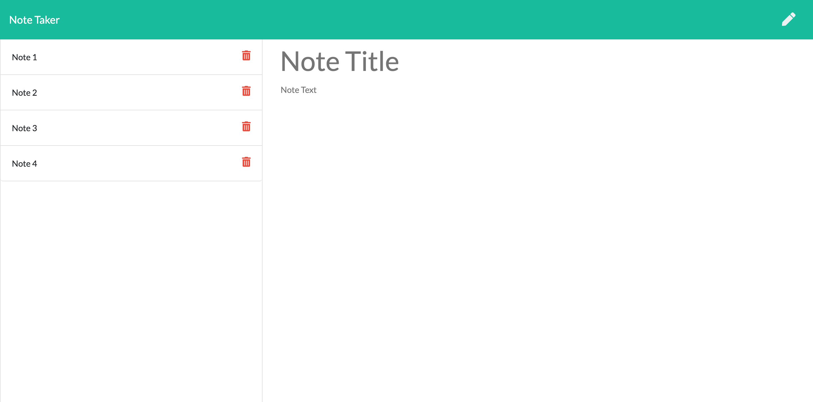

Homework-11: Express Note Taker  

This is an application that can be used to write, save, and delete notes. This application uses an express backend and it saves and retrieves note data from a JSON file.  

  

Built with:  
Visual Studio Code  
Javascript  
Node.js  
Express  

Authors:  
Ilana Shaffer  

Acknowledgments:  
University of Denver - Bootcamp Spot Assignment